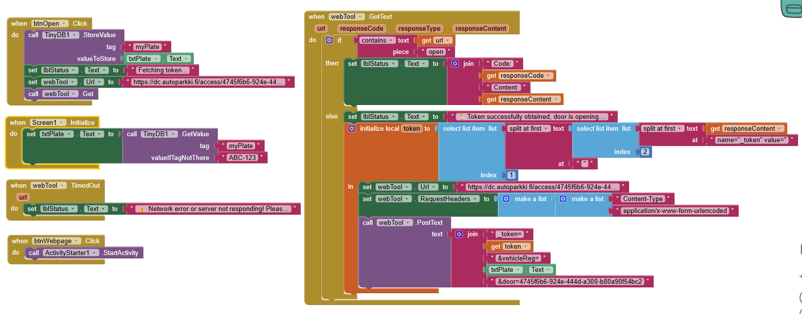
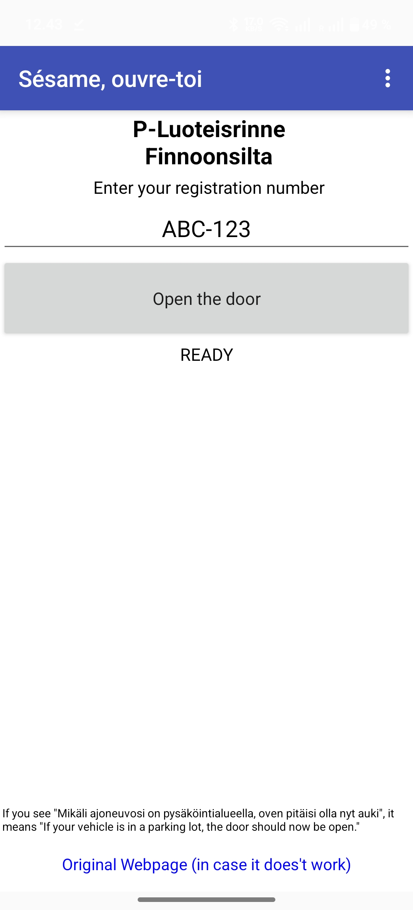
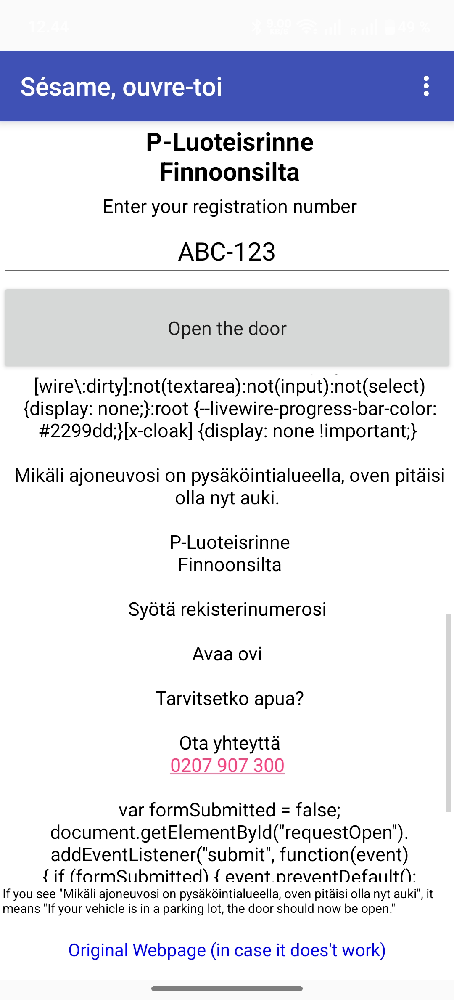

# 🚗 Finnoonsilta Carport Opener (P-Luoteisrinne)

A lightweight application built with **MIT App Inventor** to automate the opening process of the Finnoonsilta P-Luoteisrinne carport door.

---

## 🇬🇧 English Description

### 🌟 Features
- **One-Tap Opening**: No more scanning QR codes or waiting for slow browser pages in the cold.
- **Auto-Remember**: Remembers your license plate locally on your phone (using TinyDB).
- **Session Handling**: Automatically manages CSRF tokens and cookies to prevent "Page Expired" errors.
- **Multi-Garage Support**: This app can work with **other Autoparkki locations**. Simply import the `.aia` file and update the URL in the blocks to match your specific garage's access link.

### 📱 Device Compatibility
- **Android**: Pre-built `.apk` is available in the Releases section.
- **iOS (iPhone/iPad)**: You can run this on iOS! Download the `.aia` source file, upload it to [MIT App Inventor](http://ai2.appinventor.mit.edu/), and use the **MIT AI2 Companion** app from the App Store to run it, or build it using the App Inventor iOS build server.

### 📥 Installation
1. Go to the [Releases](https://github.com/Xiaolong-6/Open-sesame/releases) section.
2. **Android**: Download `.apk`.
3. **iOS/Source**: Download `.aia` and import to App Inventor.

---

## 🇫🇮 Suomeksi (Finnish)

### 🌟 Ominaisuudet
- **Avaus yhdellä painalluksella**: Ei enää QR-koodien skannaamista pakkasessa.
- **Monen autotallin tuki**: Tämä sovellus toimii myös **muissa Autoparkki-kohteissa**. Tuo `.aia`-tiedosto App Inventoriin ja päivitä lohkojen URL-osoite vastaamaan omaa autotalliasi.
- **Automaattinen muisti**: Sovellus muistaa rekisterinumerosi (TinyDB).
- **Istuntojen hallinta**: Estää "Sivu vanhentunut" -virheet hallitsemalla evästeet ja tunnukset automaattisesti.

### 📱 Laitteiden yhteensopivuus
- **Android**: Valmis `.apk`-tiedosto löytyy Releases-osiosta.
- **iOS (iPhone/iPad)**: Sovellus toimii myös iOS:llä! Lataa `.aia`-lähdetiedosto, siirrä se [MIT App Inventoriin](http://ai2.appinventor.mit.edu/) ja käytä **MIT AI2 Companion** -sovellusta (löytyy App Storesta) tai luo asennuspaketti App Inventor iOS -palvelimella.

### 📥 Asennus
1. Mene [Releases](https://github.com/Xiaolong-6/Open-sesame/releases)-osioon.
2. **Android**: Lataa `.apk`.
3. **iOS/Lähdekoodi**: Lataa `.aia` ja tuo se App Inventoriin.

---

## 🏗️ Development (Source Code)

To modify or adapt for a different garage:
1. Download the **`.aia`** file.
2. Import to [MIT App Inventor](http://ai2.appinventor.mit.edu/).
3. **To change the garage**: In the Blocks editor, locate the URL string in the `btnOpen.Click` and `webTool.GotText` blocks and replace it with your specific Autoparkki access URL.

### Logic Overview

### UI Overview

---

## ⚖️ License
This project is licensed under the MIT License.
