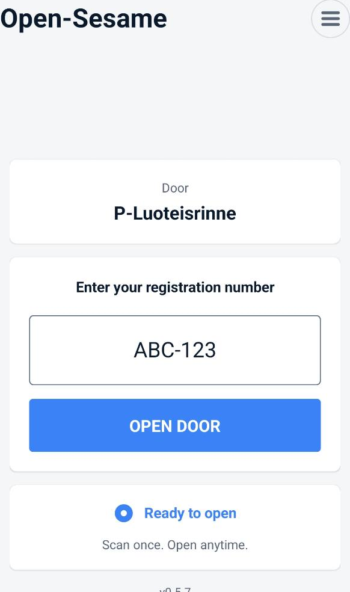
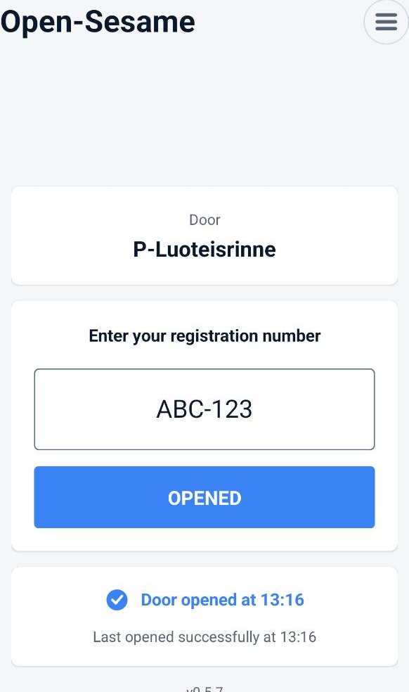
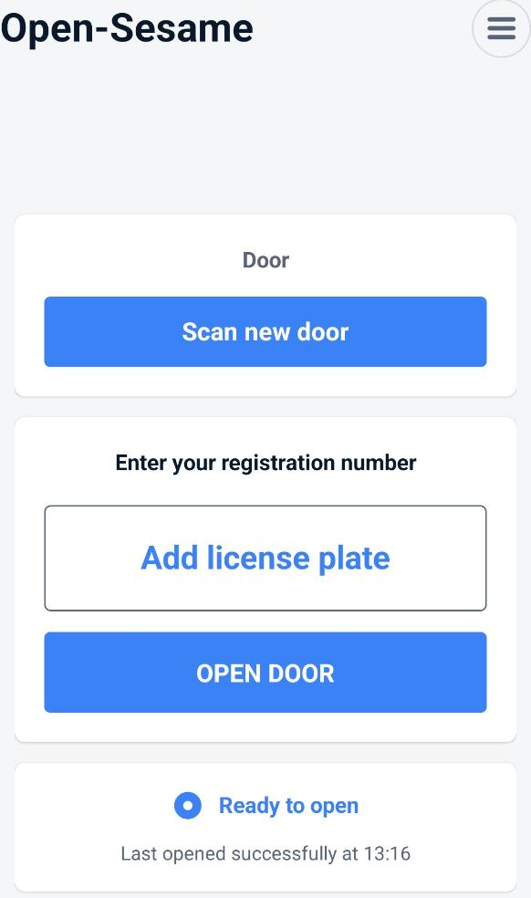
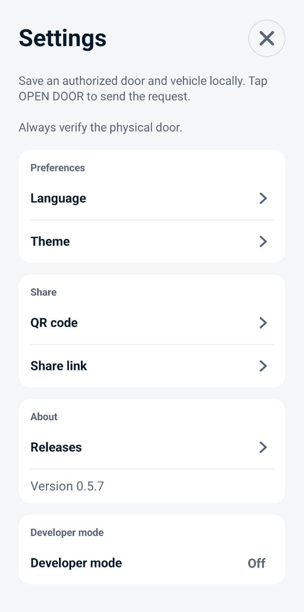
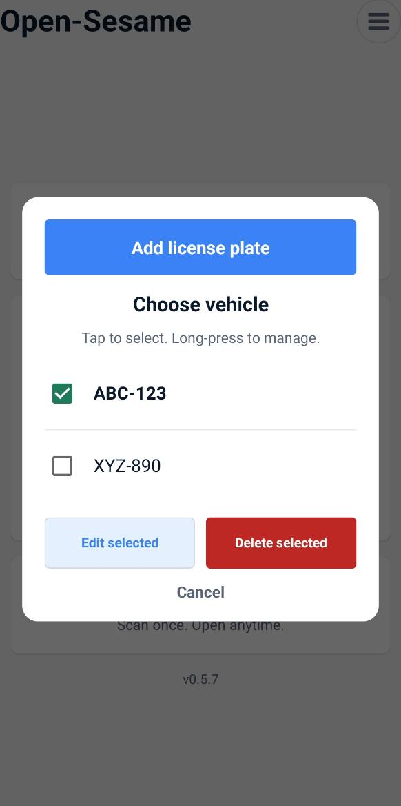

# Open-Sesame AndroidNative Lite

Open-Sesame AndroidNative Lite is a small native Kotlin Android app for faster reuse of authorized **EuroPark (autoparkki)** door QR access pages in Finland.

The active Android project now lives at the repository root. Earlier Expo / React Native files are archived under `archive/expo-react-native/`, and the original MIT App Inventor version is archived under `archive/legacy-app-inventor/` for historical reference.

## Screenshot

<p>
  
  
  
</p>

<p>
  
  
</p>

## Current version

- App version: `0.5.9`
- Android package: `com.xldev.opensesame`
- Minimum Android version: Android 8.0, API 26
- Target SDK: 35
- Default license plate: none

## Repository layout

```text
app/                         Active Android application module
gradle/                      Gradle wrapper files
build.gradle.kts             Root Gradle build file
settings.gradle.kts          Gradle project settings
gradle.properties            AndroidX / Gradle / Kotlin settings
archive/expo-react-native/   Archived Expo / React Native implementation
archive/legacy-app-inventor/ Archived MIT App Inventor implementation
```

## Project docs

- `AGENTS.md`: handoff rules for future coding agents.
- `docs/ARCHITECTURE.md`: native Android module structure and runtime flow.
- `docs/PRODUCT_PRINCIPLES.md`: product, UI, interaction, and privacy principles.
- `docs/RELEASE.md`: release checklist, APK signing, screenshots, and GitHub Release process.

## For users

### What it does

- Scan an authorized EuroPark (autoparkki) door QR code once.
- Save the door URL locally on this phone.
- Save one or more license plates locally on this phone.
- Confirm the selected door and vehicle on the main screen.
- Tap `OPEN DOOR` to submit the saved door URL and selected plate faster.
- Use the card menus to choose, add, edit, or delete saved profiles.
- Use the Developer mode checkbox in Help to show or hide advanced diagnostics.

### Important limitations

- Use this app only with EuroPark/autoparkki doors and license plates that you are authorized to use.
- The app does not bypass EuroPark access control.
- The app does not physically detect whether the door opened.
- A successful app response means the web request was sent or accepted by the parsed webpage flow; the user still needs to visually verify the door.
- The app is currently targeted at EuroPark/autoparkki access pages in Finland. It may not work outside that webpage flow.
- Door URLs and license plates are stored locally on the device, not in a cloud account.
- Local storage uses app-private Android preferences, not end-to-end encryption.

### Suomenkielinen lyhyt kuvaus

Open-Sesame on epävirallinen paikallinen apusovellus EuroParkin Suomessa käyttämille autoparkki-ovien QR-verkkosivuille. Sovellus tallentaa käyttäjän itse skannaaman valtuutetun oven URL-osoitteen ja rekisterinumeron puhelimeen, jotta sama avauspyyntö voidaan lähettää myöhemmin nopeammin.

Sovellus ei kierrä kulunvalvontaa, ei takaa oven avautumista eikä tarkista fyysisesti, avautuiko ovi. Käytä sovellusta vain oviin ja rekisterinumeroihin, joihin sinulla on käyttöoikeus.

## For developers

### Runtime flow

1. `MainActivity` loads local door and plate profiles from `ProfileStore`.
2. If there is no saved plate, the Vehicle card prompts the user to add one.
3. The Door card opens saved-door selection, or starts `QrScannerActivity` directly when no door is saved. The scanner uses CameraX / ML Kit to scan QR content.
4. `MainActivity.normalizeAutoparkkiAccessUrl()` accepts only HTTPS URLs whose host is `autoparkki.fi` or a subdomain and whose path starts with `/access/`.
5. When a door URL is saved, `AutoparkkiOpener.suggestDoorName()` may GET the page and derive a readable door name from the legacy page text.
6. The Vehicle card adds a plate directly when empty, or opens saved-plate selection when profiles exist.
7. Door and Vehicle picker rows can be tapped to select, or long-pressed to enter selection mode for editing one selected item or deleting selected items.
8. `OPEN DOOR` calls `MainActivity.openDoor()`, which delegates the request to `AutoparkkiOpener.openDoor(door, plate)` on a worker thread.
9. Advanced diagnostics are hidden from the default main screen and call `AutoparkkiOpener.debugAccessInfo()` only after developer mode is enabled.

### Door-opening request logic

`AutoparkkiOpener.openDoor()` mirrors the legacy autoparkki webpage workflow:

1. Validate that the stored access URL is an HTTPS EuroPark/autoparkki `/access/` URL.
2. Normalize the selected license plate to uppercase.
3. Send `GET` to the stored access URL.
4. Parse the first HTML `<form>` from the returned page.
5. Find the plate input field by likely names such as plate, license/licence, registration, register, regno, rekister, vehicle, or car; otherwise fall back to the first text input.
6. Copy existing non-submit form controls into a request parameter map.
7. Replace the detected plate-field value with the selected plate.
8. Find a submit control that looks like open/avaa/ovi/door/submit, or fall back to the first submit control.
9. Resolve the form action relative to the final GET URL.
10. Submit the form with either GET or POST, depending on the parsed form method.
11. Treat HTTP 2xx plus no obvious error text as a sent/accepted request. If the page text explicitly contains success-like wording, report a stronger success message.

The app **does not** use a hardware sensor, camera check, Bluetooth state, barrier status API, or any independent door-state verification. It cannot know whether the physical door opened. Any success/failure message is based only on HTTP status and parsed webpage text.

## Build

Open this repository root in Android Studio, then run:

```text
Build -> Build Bundle(s) / APK(s) -> Build APK(s)
```

Debug APK output:

```text
app/build/outputs/apk/debug/app-debug.apk
```

From the command line on Windows:

```powershell
.\gradlew.bat assembleDebug
```

## Changelog

See [GitHub Releases](https://github.com/Xiaolong-6/Open-sesame/releases) for version-by-version release notes and APK downloads.

### 0.5.9

- Changed the Android application ID and Kotlin namespace to `com.xldev.opensesame`.
- Android treats this package as a separate app from earlier `com.xl6.opensesame` builds.

### 0.5.8

- Current signed release build.
- Refined the native Android Lite UI around one-tap door opening.
- Added Settings, sharing, QR release sharing, localization, and theme preferences.
- Updated README screenshots and sanitized archived documentation before release.

### Earlier history

- `0.4.x`: Added sharing, localization, Settings, Developer mode controls, and light/dark/system theme support.
- `0.3.x`: Reworked the early Step UI into the native one-tap opener and hardened QR/access handling.
- `0.2.x`: Initial native Kotlin Android Lite prototype with QR scanning, local profile storage, and EuroPark/autoparkki request handling.

## Safety note

Open-Sesame must only be used with garage access URLs and license plates that the user is authorized to use. It does not bypass access control; it automates the same authorized QR/web access workflow.
